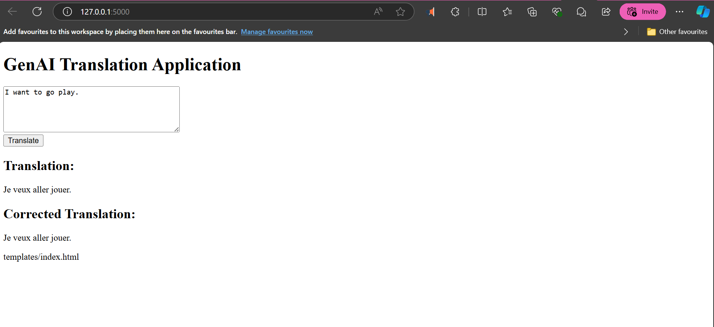
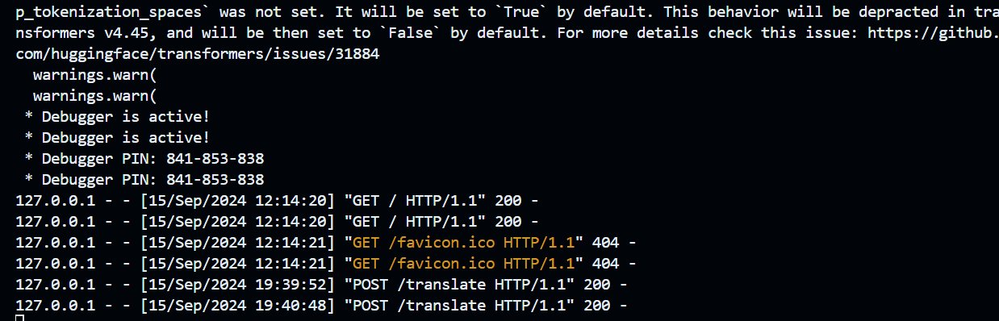

# Privacera-test
This application demonstrates the capabilities of a Generative AI Large Language Model (LLM) using pre-trained models from Hugging Face's Transformers library. The application translates text from English to French and corrects the grammar of the translation.

## Features
- Accepts user input through a text box.
- Translates English text to French using a pre-trained translation model.
- Corrects the grammar of the translated text using a grammar correction model.
- Displays both the translated and corrected texts on the web page.

## Requirements
- Python 3.7 or higher
- Flask
- Transformers (Hugging Face library)
- PyTorch (for running the models)

## Setup and Installation
1. Clone the repository:
    ```bash
    git clone https://github.com/jaeckanaquth/Privacera-test.git
    cd Privacera-test
    ```

2. Install the required dependencies:
    ```bash
    pip install -r requirements.txt
    ```

3. Run the application:
    ```bash
    python app.py
    ```

4. Open your browser and navigate to `http://127.0.0.1:5000/` to interact with the application.





## Usage
- Enter the text you want to translate in the text box and click 'Translate'.
- The application will display the translated text and its corrected version.

